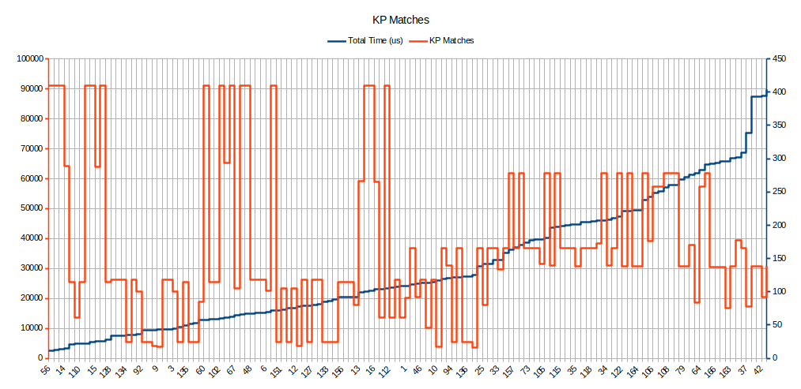

# SFND 2D Feature Tracking

## Dependencies for Running Locally
1. cmake >= 2.8
2. make >= 4.1 (Linux, Mac), 3.81 (Windows)
3. OpenCV >= 4.1
4. gcc/g++ >= 5.4
5. Ubuntu 20.04
 

## Basic Build Instructions

1. Clone this repo.
2. Make a build directory in the top level directory: `mkdir build && cd build`
3. Compile: `cmake .. && make` If there are build issues please comment line no 98 ,153  and uncomment line no 97, 152 in matching2D_Student.cpp. I had `detector = cv::SIFT::create()` working with the opencv version 4.5.3-dev. But had to use `descriptor = cv::xfeatures2d::SIFT::create()` on Udacity desktop.
4. Run it with specifying path and bVis arguments. path is the path to the image folder. The bVis takes 3 values true = slower option with cv showing the kypoint matches. false = faster options without showing the cv imshow window. avg will output average values for the total time taken and keypoint matches.    
 `./2D_feature_tracking path bVis`.  
 ` path = path to image folder`  
 ` bVis = true , false , avg `  

## Ruberic Points 
#### MP.0 Mid-Term Report   
Writeup - This file and the data and images can be found in Data folder.
#### MP.1 Data Buffer Optimization
MidTermProject_Camera_Student.cpp line no 46 implemented a circular buffer of size 2.
`boost::circular_buffer<DataFrame> dataBuffer(dataBufferSize);`
#### MP.2 Keypoint Detection and  MP.3 Keypoint Removal
`int detectKeypoints(boost::circular_buffer<DataFrame> *dataBuffer,int detType)` function in helper.h file takes the detType of int values 0..6 corresponding to 
`const string DetectorTypes[]=  {"SHITOMASI ","HARRIS   ", "FAST      ", "BRISK    ", "ORB       ", "AKAZE    ", "SIFT     "};` . This function will calculate the keypoints based on the selected algorithm , filter them to the vehicle keypoints rectangle and return total time taken in microseconds. 
#### MP.4 Keypoint Descriptors
`int descKeypoints_helper(boost::circular_buffer<DataFrame> *dataBuffer,  int descType)` function in helper.h takes the descType of int values 0..5 correspondig to  `const string DescreptorTypes[]={"BRISK     ","BRIEF    ", "ORB       ", "FREAK    ", "AKAZE    ", "SIFT     "};` . This function will calculate the descriptors for the given algorithm and return the total time taken in microseconds.  The ORB throws out of memory exception for certain detection algorithms and AKAZE will only work with AKAZE keypoint detector and throws cv exception for other combinations. These exceptions are caught and retuned as -1 error value. This can be seen as - 1 in the for the time column in the data files. 
#### MP.5 Descriptor Matching MP.6 Descriptor Distance Ratio
`int matchDescriptors_helper( boost::circular_buffer<DataFrame>  *dataBuffer,  int descType, int matcherType, int selectorType)` function in helper.h takes in the matcherType 0..1 for `const string MatcherTypes[]={"MAT_BF     ","MAT_FLANN    "};` and selectorType 0..1 for `const string SelectorTypes[]={"SEL_NN     ","SEL_KNN    "};` also takes in the descType to check the type HOG or Binary. The MAT_BF is used with crosscheck=true.    

The main() function runs through all the combinations of following options.

`const string DetectorTypes[]=  {"SHITOMASI ","HARRIS   ", "FAST      ", "BRISK    ", "ORB       ", "AKAZE    ", "SIFT     "}; `    
`const string DescreptorTypes[]={"BRISK     ","BRIEF    ", "ORB       ", "FREAK    ", "AKAZE    ", "SIFT     "};`      
`const string MatcherTypes[]={"MAT_BF     ","MAT_FLANN    "};`     
`const string SelectorTypes[]={"SEL_NN     ","SEL_KNN    "};`      

if run with bVis=ture it will show the kypoint matches with `cv::imshow(windowname, matchImg);` 100ms for each image. This is a slower option. To turn this off for only display the points and timing data use bVis=false. The output will show the combination of matcher , selector , detector , descreptor , no of keypoint , time taken during each step and no of matches. Please find the results in Data/Data_Full.csv. The timing columns with value -1 are errors.

For easier evaluation the average values for total time = detector+descriptor over the 10 frames and matches over 9 frames are caluclated and can be found in Data/Data_avg.csv. The run these caluclations run with bVis=avg option. 

#### MP.7 Performance Evaluation 1
Below chart shows the keypoints detected and time taken in (us) for each detector type over the 10 image frames. Looking at this, it can be seen that FAST algorithm will detect the most points in least time. Also BRISK algorithm will detect large number of keypoints at the cost of more time.    

#### MP.8 Performance Evaluation 2
Below chart shows the data from Data/Data_avg.csv. The data is sorted in increasing order for time value and corresponding matches are plotted on the same chart. These are average points for each combinations.   

#### MP.9 Performance Evaluation 3
Below is the filtered data for matches > 250 and time < 50 ms showing the best performing algorithms. As mentioned above the FAST and BRISK will outperform. The time here is total time = detector+descriptor , the keypoint match time is negligble. Also the erronous data with 0 matches is removed from the study.  

 
 

 
 
 

